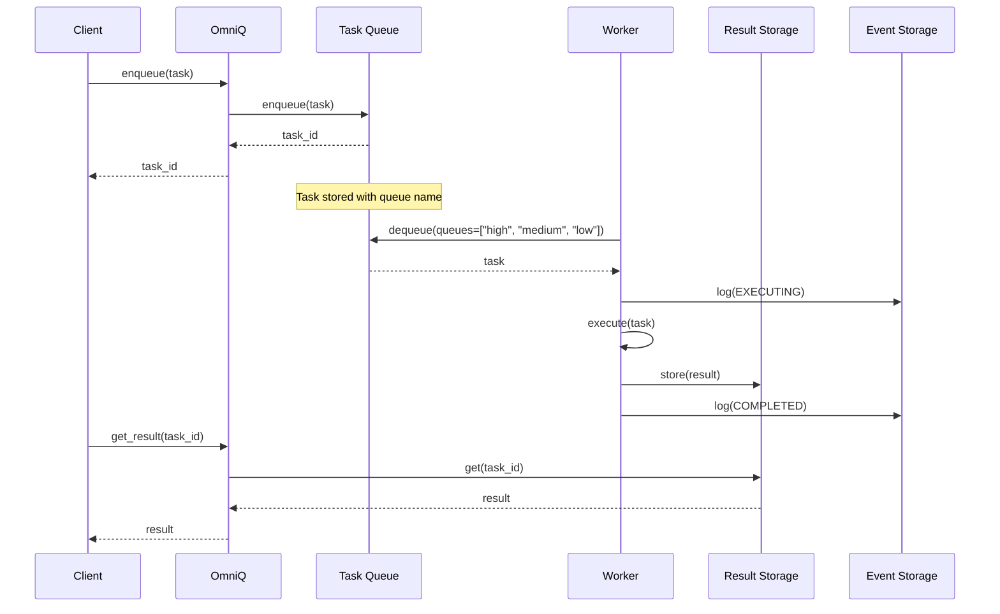

# OmniQ: A Flexible Task Queue Library for Python

## Project Description

OmniQ is a modular Python task queue library designed for both local and distributed task processing. It provides a flexible architecture that supports multiple storage backends, worker types, and configuration methods. OmniQ enables developers to easily implement task queuing, scheduling, and distributed processing in their applications with both synchronous and asynchronous interfaces.

**Key Features:**

- Multiple storage backends (File, Memory, SQLite, PostgreSQL, Redis, NATS)
- Multiple worker types (Async, Thread Pool, Process Pool, Gevent)
- Support for both synchronous and asynchronous tasks and interfaces
- Task scheduling with cron and interval patterns (including pause/resume capability)
- Task dependencies and workflow management
- Task lifecycle event logging
- Result storage and retrieval
- Flexible configuration via code, objects, dictionaries, YAML files, or environment variables
- Multiple named queues with priority ordering
- Cloud storage support through fsspec (S3, Azure, GCP)
- TTL for tasks and results with automatic cleanup

## Python Libraries Overview

### Core Dependencies

- **msgspec**: High-performance serialization and validation
- **dill**: Advanced object serialization beyond pickle
- **fsspec**: Filesystem abstraction for local and cloud storage
- **pyyaml**: YAML file parsing for configuration
- **python-dateutil**: Date and time utilities for scheduling
- **anyio**: Synchronous wrappers library
- **croniter**: Cron-style scheduling implementation

### Storage Backends

- **aiosqlite**: Async SQLite database interface
- **asyncpg**: Async PostgreSQL database interface
- **redis**: Redis client (includes redis.asyncio)
- **nats-py**: NATS messaging system client

### Cloud Storage (Optional)

- **s3fs**: S3 filesystem implementation for fsspec
- **adlfs**: Azure Data Lake filesystem implementation for fsspec
- **gcsfs**: Google Cloud Storage filesystem implementation for fsspec

### Worker Implementations

- **gevent**: Coroutine-based concurrency library for Gevent worker

### Development Dependencies

- **pytest**: Testing framework
- **pytest-asyncio**: Async testing support for pytest
- **pytest-cov**: Test coverage reporting
- **black**: Code formatting
- **isort**: Import sorting
- **mypy**: Static type checking
- **ruff**: Fast Python linter

## Core Design Principles

- **Async First, Sync Wrapped:** The core library is implemented asynchronously for maximum performance, with synchronous wrappers providing a convenient blocking API
- **Separation of Concerns:** Task queue, result storage, and event logging are decoupled and independent
- **Interface-Driven:** All components implement common interfaces
- **Storage Abstraction:** Use `fsspec` for file and memory storage with extended capabilities
- **Worker Flexibility:** Support multiple worker types (async, thread, process, gevent)
- **Serialization Strategy:** Intelligent serialization with `msgspec` and `dill` for task enqueuing/dequeuing
- **Storage Independence:** Allow independent selection of storage backends for tasks, results, and events
- **SQL-Based Event Logging:** Use SQL or structured storage for efficient event querying and analysis
- **Task Lifecycle Management:** Support task TTL and automatic cleanup of expired tasks
- **Flexible Scheduling:** Enable pausing and resuming of scheduled tasks

## Architecture Overview

```mermaid
flowchart TD
    A[OmniQ] --> B[Task Queue]
    A --> C[Result Storage]
    A --> D[Event Storage]
    A --> E[Worker]
    
    B --> B1[File Queue]
    B --> B2[Memory Queue]
    B --> B3[SQLite Queue]
    B --> B4[PostgreSQL Queue]
    B --> B5[Redis Queue]
    B --> B6[NATS Queue]
    
    C --> C1[File Storage]
    C --> C2[Memory Storage]
    C --> C3[SQLite Storage]
    C --> C4[PostgreSQL Storage]
    C --> C5[Redis Storage]
    C --> C6[NATS Storage]
    
    D --> D1[SQLite Storage]
    D --> D2[PostgreSQL Storage]
    D --> D3[File Storage]
    
    E --> E1[Async Worker]
    E --> E2[Thread Pool Worker]
    E --> E3[Process Pool Worker]
    E --> E4[Gevent Pool Worker]
    
    F[Backend] --> F1[File Backend]
    F --> F2[SQLite Backend]
    F --> F3[PostgreSQL Backend]
    F --> F4[Redis Backend]
    F --> F5[NATS Backend]
    
    F1 --> B1
    F1 --> C1
    F1 --> D3
    
    F2 --> B3
    F2 --> C3
    F2 --> D1
    
    F3 --> B4
    F3 --> C4
    F3 --> D2
    
    F4 --> B5
    F4 --> C5
    
    F5 --> B6
    F5 --> C6
```



### Enhanced System Architecture

```
TaskQueue (Orchestrator)
├── Interface Layer
│   ├── Async API (Core Implementation)
│   └── Sync API (Wrappers around async)
├── Task Management Layer
│   ├── Task (data model with TTL)
│   ├── Schedule (timing logic with pause/resume)
│   └── TaskDependencyGraph (dependency resolution)
├── Storage Layer
│   ├── Task Queue Interface
│   │   ├── File Queue (using fsspec with DirFileSystem for memory, local, S3, Azure, GCP)
│   │   ├── Memory Queue (using fsspec MemoryFileSystem)
│   │   ├── SQLite Queue
│   │   ├── PostgreSQL Queue
│   │   ├── Redis Queue
│   │   └── NATS Queue
│   ├── Result Storage Interface (independent from task queue)
│   │   ├── File Storage (using fsspec for memory, local, S3, Azure, GCP)
│   │   ├── Memory Storage (using fsspec MemoryFileSystem)
│   │   ├── SQLite Storage
│   │   ├── PostgreSQL Storage
│   │   ├── Redis Storage
│   │   └── NATS Storage
│   └── Event Storage Interface (SQL-based or JSON files)
│       ├── SQLite Storage
│       ├── PostgreSQL Storage
│       └── File Storage (JSON files)
├── Execution Layer
│   ├── Worker Types
│   │   ├── Async Workers
│   │   ├── Thread Pool Workers
│   │   ├── Process Pool Workers
│   │   └── Gevent Pool Workers
│   ├── Task Execution
│   └── CallbackManager (lifecycle hooks)
```

### Component Architecture

```mermaid
flowchart TD
    subgraph "OmniQ Interface"
        OmniQ[OmniQ Class]
    end
    
    subgraph "Task Queue Layer"
        TQ[Task Queue Interface]
        TQ --> FQ[File Queue]
        TQ --> MQ[Memory Queue]
        TQ --> SQ[SQLite Queue]
        TQ --> PQ[PostgreSQL Queue]
        TQ --> RQ[Redis Queue]
        TQ --> NQ[NATS Queue]
    end
    
    subgraph "Worker Layer"
        W[Worker Interface]
        W --> AW[Async Worker]
        W --> TW[Thread Pool Worker]
        W --> PW[Process Pool Worker]
        W --> GW[Gevent Pool Worker]
    end
    
    subgraph "Storage Layer"
        RS[Result Storage Interface]
        RS --> FRS[File Result Storage]
        RS --> MRS[Memory Result Storage]
        RS --> SRS[SQLite Result Storage]
        RS --> PRS[PostgreSQL Result Storage]
        RS --> RRS[Redis Result Storage]
        RS --> NRS[NATS Result Storage]
        
        ES[Event Storage Interface]
        ES --> SES[SQLite Event Storage]
        ES --> PES[PostgreSQL Event Storage]
        ES --> FES[File Event Storage]
    end
    
    subgraph "Configuration Layer"
        Config[Configuration System]
        Config --> YamlConfig[YAML Config]
        Config --> EnvConfig[Environment Variables]
        Config --> DictConfig[Dictionary Config]
        Config --> ObjectConfig[Object Config]
    end
    
    subgraph "Backend Layer"
        Backend[Backend Interface]
        Backend --> FB[File Backend]
        Backend --> SB[SQLite Backend]
        Backend --> PB[PostgreSQL Backend]
        Backend --> RB[Redis Backend]
        Backend --> NB[NATS Backend]
    end
    
    OmniQ --> TQ
    OmniQ --> W
    OmniQ --> RS
    OmniQ --> ES
    OmniQ --> Config
    
    Backend --> TQ
    Backend --> RS
    Backend --> ES
    
    TQ <--> W
    W --> RS
    W --> ES
```



### Data Flow



### Project Structure

```
omniq/
├── pyproject.toml          # uv project configuration
├── uv.lock                 # uv lock file
├── README.md
├── src/
│   └── omniq/              # Source code directory
│       ├── __init__.py
│       ├── models/         # Data models and configuration
│       │   ├── __init__.py
│       │   ├── task.py
│       │   ├── schedule.py
│       │   ├── result.py
│       │   ├── event.py
│       │   └── config.py
│       ├── storage/        # Storage implementations
│       │   ├── __init__.py
│       │   ├── base.py
│       │   ├── file.py
│       │   ├── memory.py
│       │   ├── sqlite.py
│       │   ├── postgres.py
│       │   ├── redis.py
│       │   └── nats.py
│       ├── serialization/  # Serialization utilities
│       │   ├── __init__.py
│       │   ├── base.py
│       │   ├── msgspec.py
│       │   └── dill.py
│       ├── queue/          # Task queue implementations
│       │   ├── __init__.py
│       │   ├── base.py
│       │   ├── file.py
│       │   ├── memory.py
│       │   ├── sqlite.py
│       │   ├── postgres.py
│       │   ├── redis.py
│       │   └── nats.py
│       ├── workers/        # Worker implementations
│       │   ├── __init__.py
│       │   ├── base.py
│       │   ├── async.py
│       │   ├── thread.py
│       │   ├── process.py
│       │   └── gevent.py
│       ├── events/         # Event system
│       │   ├── __init__.py
│       │   ├── logger.py
│       │   └── processor.py
│       ├── config/         # Configuration system
│       │   ├── __init__.py
│       │   ├── settings.py
│       │   ├── env.py
│       │   └── loader.py
│       ├── backend/        # Backend implementations
│       │   ├── __init__.py
│       │   ├── base.py
│       │   ├── file.py
│       │   ├── sqlite.py
│       │   ├── postgres.py
│       │   ├── redis.py
│       │   └── nats.py
│       └── core.py         # Core OmniQ implementation
├── tests/
│   ├── __init__.py
│   ├── test_models/
│   ├── test_storage/
│   ├── test_serialization/
│   ├── test_queue/
│   ├── test_workers/
│   ├── test_events/
│   ├── test_config/
│   ├── test_backend/
│   └── test_core/
└── docs/
    ├── index.md
    ├── getting_started.md
    ├── configuration.md
    ├── task_queues.md
    ├── workers.md
    ├── storage.md
    ├── events.md
    ├── backends.md
    └── examples.md
```

## Key Design Decisions

### Async First, Sync Wrapped Implementation

OmniQ adopts an "Async First, Sync Wrapped" approach for maximum performance and flexibility:

- **Core Implementation**: All core functionality is implemented using async/await
- **Sync Wrappers**: Synchronous interfaces are implemented as wrappers around async methods
- **Performance**: This approach optimizes for I/O-bound operations common in task queues
- **Consistency**: Maintains a single source of truth for each component's logic
- **Implementation Pattern**:
  ```python
  # Async core implementation
  class AsyncTaskQueue:
      async def enqueue(self, task):
          # Async implementation
      
      async def __aenter__(self):
          await self.connect()
          return self
  
  # Sync wrapper
  class TaskQueue:
      def __init__(self, *args, **kwargs):
          self._async_queue = AsyncTaskQueue(*args, **kwargs)
      
      def enqueue(self, task):
          return anyio.from_thread.run(self._async_queue.enqueue(task))
      
      def __enter__(self):
          anyio.from_thread.run(self._async_queue.__aenter__())
          return self
  ```

### Component Separation

OmniQ separates task queue, result storage, event storage, and workers into independent components. This allows for flexible configuration and deployment options:

- Use different storage backends for tasks, results, and events
- Replace components without affecting the rest of the system
- Scale components independently based on workload

### Backend Abstraction

The Backend classes provide a unified interface for storage systems:

- Create task queue, result storage, and event storage from a single backend
- Simplify configuration by using a single backend for all components
- Mix and match backends for different components

### Multiple Named Queues

All task queue implementations support multiple named queues:

- File Queue: Directory structure for each queue
- SQLite/PostgreSQL Queue: Queue column approach with priority ordering
- Redis Queue: Queue prefixes
- NATS Queue: Subject prefixes

### Worker Flexibility

Workers are independent of task queues but can be initialized with a queue reference:

- All worker types can handle both sync and async tasks
- Async workers run sync tasks in thread pools
- Thread/process workers run async tasks in event loops
- Workers can process tasks from multiple queues with priority ordering

### Configuration System

OmniQ provides multiple configuration methods:

- Direct parameter initialization
- Type-validated config objects using msgspec.Struct
- Dictionary-based configuration
- YAML file configuration
- Environment variable overrides

### Serialization Strategy

OmniQ uses a dual serialization approach:

- msgspec for high-performance serialization of compatible types
- dill for serialization of complex Python objects
- Automatic selection based on type detection

### Storage Strategy

- **fsspec Integration**: Use `fsspec` for file and memory storage with extended capabilities
- **Multiple Backends**: Support various storage options for different needs
- **Unified Interface**: Common protocol for all storage backends
- **Dual Interface**: Both sync and async methods for all storage operations
- **Cloud Support**: Seamless support for S3, Azure Blob, and Google Cloud Storage through optional dependencies (s3fs, adlfs, gcsfs)
- **Unified Result Storage**: Store results in the same backend as tasks
- **Backend-Specific Optimizations**: Use specialized features of each backend for result storage
- **Base Directory Support**: Use `base_dir` parameter as prefix when creating fsspec filesystems

### Event Architecture

- **Non-blocking Logging**: Events don't slow down task execution
- **Structured Events**: Rich metadata for monitoring and debugging
- **Configurable Levels**: Runtime adjustment of logging levels
- **Dual Interface**: Both sync and async event handling
- **No Serialization**: Store task events without serialization in SQLite, PostgreSQL, or as JSON files
- **Separation**: Clear separation between library logging and task event logging

### Fault Tolerance

- **Circuit Breaker**: Prevents cascade failures in distributed storage
- **Retry Logic**: Exponential backoff with jitter
- **Graceful Degradation**: System continues with reduced functionality
- **Dead Letter Queue**: Store failed tasks for inspection

## Module Architecture

### Core Models (`omniq.models`)

**Purpose**: Define data structures and business logic

**Components**:
- `Task`: Serializable task with metadata, dependencies, callbacks, and TTL
- `Schedule`: Timing logic (cron, interval, timestamp) with pause/resume capability
- `TaskResult`: Execution outcome storage
- `TaskEvent`: Event logging data model
- `Settings`: Library settings without "OMNIQ_" prefix with environment variable overrides

**Key Design Decisions**:
- Use `msgspec.Struct` for high-performance serialization
- Support both async and sync callable references
- Implement `__hash__` and `__eq__` for dependency tracking
- Store task metadata for tracking and monitoring
- Define clear result states (pending, running, success, error)
- Include TTL for automatic task expiration
- Support schedule state management (active, paused)
- Implement settings constants without "OMNIQ_" prefix, which can be overridden by environment variables with "OMNIQ_" prefix

### Storage Interfaces (`omniq.storage`)

**Purpose**: Abstract storage backends for pluggability

**Components**:
- `BaseTaskQueue`: Abstract interface for task queue with both sync and async methods
- `BaseResultStorage`: Abstract interface for result storage with both sync and async methods
- `BaseEventStorage`: Abstract interface for event logging (SQL-based or JSON files)
- Task Queue implementations:
  - `AsyncFileQueue`: Core async implementation using `fsspec` with `DirFileSystem`
  - `FileQueue`: Sync wrapper around `AsyncFileQueue`
  - `AsyncMemoryQueue`: Core async implementation using `fsspec.MemoryFileSystem`
  - `MemoryQueue`: Sync wrapper around `AsyncMemoryQueue`
  - `AsyncSQLiteQueue`: Core async implementation using `aiosqlite`
  - `SQLiteQueue`: Sync wrapper around `AsyncSQLiteQueue`
  - `AsyncPostgresQueue`: Core async implementation using `asyncpg`
  - `PostgresQueue`: Sync wrapper around `AsyncPostgresQueue`
  - `AsyncRedisQueue`: Core async implementation using `redis.asyncio`
  - `RedisQueue`: Sync wrapper around `AsyncRedisQueue`
  - `AsyncNATSQueue`: Core async implementation using `nats.aio`
  - `NATSQueue`: Sync wrapper around `AsyncNATSQueue`
- Similar pattern for Result Storage and Event Storage implementations

**Key Design Decisions**:
- Implement async core functionality first
- Create sync wrappers around async implementations
- Use `fsspec` for file and memory storage backends with `base_dir` parameter as prefix
- Support memory, local, S3, Azure, and GCP storage locations through fsspec with optional dependencies (s3fs, adlfs, gcsfs)
- Connection pooling for distributed backends
- Transaction support for consistency
- Bulk operations for performance
- Allow independent selection of storage backends for tasks, results, and events
- Default to using the same backend type for tasks and results if not explicitly specified
- Store task events without serialization in SQLite, PostgreSQL, or as JSON files
- Support task TTL enforcement and cleanup in all storage backends
- Store schedule state (active/paused) in storage backends
- Implement task locking mechanism in all queue backends to prevent duplicate execution

### Serialization Layer (`omniq.serialization`)

**Purpose**: Task and result serialization for storage and retrieval

**Components**:
- `SerializationDetector`: Type compatibility detection
- `MsgspecSerializer`: Primary serializer for compatible types
- `DillSerializer`: Fallback serializer for complex objects
- `SerializationManager`: Orchestrates serialization strategy

**Key Design Decisions**:
- Use the same serialization approach for tasks and results
- Use `msgspec` as primary serializer for performance
- Fall back to `dill` for complex Python objects
- Store serialization format with data for proper deserialization
- Implement security measures for `dill` deserialization

### Task Queue Engine (`omniq.queue`)

**Purpose**: Core orchestration and execution logic

**Components**:
- `AsyncTaskQueue`: Async core implementation of task queue
- `TaskQueue`: Sync wrapper around async implementation
- `AsyncScheduler`: Async core implementation of scheduler
- `Scheduler`: Sync wrapper around async implementation
- `DependencyResolver`: Graph-based dependency management
- `RetryManager`: Exponential backoff and failure handling
- `TTLManager`: Task expiration and cleanup

**Key Design Decisions**:
- Event-driven architecture using asyncio queues
- Provide synchronous wrappers for all operations
- Graceful shutdown with task completion
- Circuit breaker pattern for fault tolerance
- Support multiple storage backends
- Independent configuration of task and result storage backends
- Implement task TTL enforcement and cleanup
- Support schedule pausing and resuming

### Worker Layer (`omniq.workers`)

**Purpose**: Task execution with multiple worker types

**Components**:
- `AsyncWorkerPool`: Async core implementation of worker pool
- `WorkerPool`: Sync wrapper around async implementation
- Worker implementations:
  - `AsyncWorker`: Native async execution (core implementation)
  - `ThreadWorker`: Thread pool execution (wraps async worker)
  - `ProcessWorker`: Process pool execution (wraps async worker)
  - `GeventWorker`: Gevent pool execution (wraps async worker)

**Key Design Decisions**:
- Implement async core functionality first
- Create sync wrappers around async implementations
- Support multiple worker types for different workloads
- Handle both sync and async tasks appropriately
- Implement common interface for all worker types
- Provide proper resource management and cleanup
- Worker selection based on task requirements
- Result serialization and storage after task completion
- Respect task TTL during execution

### Event System (`omniq.events`)

**Purpose**: Task lifecycle tracking and monitoring

**Components**:
- `AsyncEventLogger`: Async core implementation of event logger
- `EventLogger`: Sync wrapper around async implementation
- `AsyncEventProcessor`: Async core implementation of event processor
- `EventProcessor`: Sync wrapper around async implementation
- Event types: ENQUEUED, EXECUTING, COMPLETE, ERROR, RETRY, CANCELLED, EXPIRED, SCHEDULE_PAUSED, SCHEDULE_RESUMED

**Key Design Decisions**:
- Implement async core functionality first
- Create sync wrappers around async implementations
- Non-blocking event logging with disable option
- Structured logging with metadata
- Configurable event retention policies
- Event logging automatically disabled when no event storage is configured
- Store task events without serialization in SQLite, PostgreSQL, or as JSON files
- Track task TTL events and schedule state changes
- Clear separation between library logging and task event logging

### Configuration (`omniq.config`)

**Purpose**: Centralized configuration management

**Components**:
- `Settings`: Library settings constants without "OMNIQ_" prefix
- `EnvConfig`: Environment variable configuration with "OMNIQ_" prefix
- `ConfigProvider`: Configuration loading and validation
- `LoggingConfig`: Logging configuration

**Key Design Decisions**:
- Define settings constants without "OMNIQ_" prefix that can be overridden by environment variables with "OMNIQ_" prefix
- Environment variables as primary configuration method
- Type conversion and validation for config values
- Component-specific configuration sections
- Runtime configuration changes
- Independent configuration of task queue, result storage, and event storage
- Configuration for default task TTL
- Separate configuration for library logging and task event logging

## Development Guidelines

### Async First, Sync Wrapped Implementation Guidelines

- **Core Async Implementation**: Implement all core functionality using async/await
- **Sync Wrappers**: Create synchronous wrappers using `anyio.from_thread.run()` or event loops
- **Naming Convention**: Use `Async` prefix for core async classes, no prefix for sync wrappers. Sync wrapper methods should have a `_sync` suffix.
- **Context Managers**: Implement both `__aenter__`/`__aexit__` and `__enter__`/`__exit__`
- **Error Handling**: Preserve exception context across sync/async boundaries
- **Resource Management**: Ensure proper cleanup in both sync and async contexts

Example implementation pattern:

```python
# Async core implementation
class AsyncTaskQueue:
    async def enqueue(self, task):
        # Async implementation
        ...
    
    async def __aenter__(self):
        await self.connect()
        return self
    
    async def __aexit__(self, exc_type, exc_val, exc_tb):
        await self.close()

# Sync wrapper
class TaskQueue:
    def __init__(self, *args, **kwargs):
        self._async_queue = AsyncTaskQueue(*args, **kwargs)
    
    def enqueue(self, task):
        return anyio.from_thread.run(self._async_queue.enqueue(task))
    
    def __enter__(self):
        anyio.from_thread.run(self._async_queue.__aenter__())
        return self
    
    def __exit__(self, exc_type, exc_val, exc_tb):
        anyio.from_thread.run(self._async_queue.__aexit__(exc_type, exc_val, exc_tb))
```

### Settings and Environment Variables

- Define settings constants without "OMNIQ_" prefix
- Override settings with environment variables with "OMNIQ_" prefix
- Example: `BASE_DIR` in settings, `OMNIQ_BASE_DIR` as environment variable

```python
# settings.py
BASE_DIR = "default/path"
PROJECT_NAME = "default"

# env.py
import os
from .settings import BASE_DIR, PROJECT_NAME

base_dir = os.environ.get("OMNIQ_BASE_DIR", BASE_DIR)
project_name = os.environ.get("OMNIQ_PROJECT_NAME", PROJECT_NAME)
```

Support the following variables:
- `LOG_LEVEL` in settings, `OMNIQ_LOG_LEVEL` as env var: Set library logging level (DEBUG, INFO, WARNING, ERROR, DISABLED)
- `DISABLE_LOGGING` in settings, `OMNIQ_DISABLE_LOGGING` as env var: Disable all library logging when set to "1" or "true"
- `TASK_QUEUE_TYPE` in settings, `OMNIQ_TASK_QUEUE_TYPE` as env var: Queue backend for tasks (file, memory, sqlite, postgres, redis, nats)
- `TASK_QUEUE_URL` in settings, `OMNIQ_TASK_QUEUE_URL` as env var: Connection string for task queue backend
- `RESULT_STORAGE_TYPE` in settings, `OMNIQ_RESULT_STORAGE_TYPE` as env var: Storage backend for results (file, memory, sqlite, postgres, redis, nats)
- `RESULT_STORAGE_URL` in settings, `OMNIQ_RESULT_STORAGE_URL` as env var: Connection string for result storage backend
- `EVENT_STORAGE_TYPE` in settings, `OMNIQ_EVENT_STORAGE_TYPE` as env var: Storage backend for events (sqlite, postgres, file)
- `EVENT_STORAGE_URL` in settings, `OMNIQ_EVENT_STORAGE_URL` as env var: Connection string for event storage backend
- `FSSPEC_URI` in settings, `OMNIQ_FSSPEC_URI` as env var: URI for fsspec (e.g., "file:///path", "s3://bucket", "memory://")
- `DEFAULT_WORKER` in settings, `OMNIQ_DEFAULT_WORKER` as env var: Default worker type (async, thread, process, gevent)
- `MAX_WORKERS` in settings, `OMNIQ_MAX_WORKERS` as env var: Maximum number of workers
- `THREAD_WORKERS` in settings, `OMNIQ_THREAD_WORKERS` as env var: Thread pool size
- `PROCESS_WORKERS` in settings, `OMNIQ_PROCESS_WORKERS` as env var: Process pool size
- `GEVENT_WORKERS` in settings, `OMNIQ_GEVENT_WORKERS` as env var: Gevent pool size
- `TASK_TIMEOUT` in settings, `OMNIQ_TASK_TIMEOUT` as env var: Default task execution timeout in seconds
- `TASK_TTL` in settings, `OMNIQ_TASK_TTL` as env var: Default time-to-live for tasks in seconds
- `RETRY_ATTEMPTS` in settings, `OMNIQ_RETRY_ATTEMPTS` as env var: Default number of retry attempts
- `RETRY_DELAY` in settings, `OMNIQ_RETRY_DELAY` as env var: Default delay between retries in seconds
- `RESULT_TTL` in settings, `OMNIQ_RESULT_TTL` as env var: Default time-to-live for task results in seconds
- `COMPONENT_LOG_LEVELS` in settings, `OMNIQ_COMPONENT_LOG_LEVELS` as env var: JSON string with per-component logging levels

### Component Configuration

- Use msgspec.Struct for type-validated configuration
- Support multiple initialization methods:
  - Direct parameters
  - Config objects
  - Dictionaries
  - YAML files

```python
@classmethod
def from_config(cls, config):
    """Create instance from config object"""
    return cls(**config.dict())

@classmethod
def from_dict(cls, config_dict):
    """Create instance from dictionary"""
    return cls(**config_dict)

@classmethod
def from_config_file(cls, config_path):
    """Create instance from config file"""
    config_dict = load_yaml_config(config_path)
    return cls.from_dict(config_dict)
```

### Worker Implementation

- All worker types should handle both sync and async tasks
- Async workers should run sync tasks in thread pools
- Thread/process workers should run async tasks in event loops
- Workers should process tasks from multiple queues with priority ordering
- Implement both sync and async context managers

### Storage Implementation

- Implement multiple queues in all task queue backends
- Use queue column approach for SQL-based queues
- Use directory structure for file-based queues
- Use prefixes for Redis and NATS queues
- Implement both sync and async context managers
- Use fsspec for file and memory storage with DirFileSystem when possible
- Support optional cloud storage through s3fs, gcsfs, and adlfs

### Logging and Event Management

- **Separate Library Logging from Task Events**: Library logging is for debugging and monitoring the library itself, while task events are for tracking task lifecycle
- **Library Logging Configuration**: Set via function, settings constant, or environment variable
- **Task Event Logging**: Automatically disabled when no event storage is configured
- **Event Storage**: Only enabled when explicitly configured

### Task Queue and Worker Coordination

- **Task Locking**: Implement locking mechanism in all queue backends to prevent duplicate execution
- **NATS Queue Groups**: Use NATS queue groups for exclusive task consumption
- **Redis Atomic Operations**: Use Redis atomic operations for task locking
- **Database Transactions**: Use database transactions and row locking for SQL-based queues
- **Distributed Coordination**: Implement appropriate locking mechanisms for each queue backend type

### File Storage Implementation

- Implement file storage for tasks, results, and events using fsspec
- Support the following storage locations:
  - Memory: Using fsspec MemoryFileSystem
  - Local: Using fsspec LocalFileSystem with DirFileSystem when possible
  - S3: Using s3fs (optional dependency)
  - Azure: Using adlfs (optional dependency)
  - GCP: Using gcsfs (optional dependency)
- Use `base_dir` parameter in initialization as the prefix when creating fsspec filesystems
- Store task events as JSON files when using File Storage Backend for events

### uv Project Management

- Use `uv` for dependency management and project setup
- Initialize the project with `uv init`
- Manage dependencies with `uv add` and `uv remove`

## Usage Examples

### Basic Usage with AsyncOmniQ

```python
from omniq import AsyncOmniQ
from omniq.queue import FileTaskQueue
from omniq.storage import SQLiteResultStorage, PostgresEventStorage
import datetime as dt

# Create AsyncOmniQ instance with default components
oq = AsyncOmniQ(
    project_name="my_project",
    task_queue=FileTaskQueue(base_dir="some/path", queues=["low", "medium", "high"]),
    result_store=SQLiteResultStorage(base_dir="some/path"),
    event_store=PostgresEventStorage(host="localhost", port=5432, username="postgres")
)

# Define an async task
async def async_task(name):
    print(f"Hello {name}")
    return name

# Start the worker
await oq.start_worker()

# Enqueue a task
task_id = await oq.enqueue(
    func=async_task,
    func_args=dict(name="Tom"),
    queue_name="low",
    run_in=dt.timedelta(seconds=100),
    ttl=dt.timedelta(hours=1),
    result_ttl=dt.timedelta(minutes=5)
)

# Get the result
result = await oq.get_result(task_id)

# Schedule a recurring task
schedule_id = await oq.schedule(
    func=async_task,
    func_args=dict(name="Tom"),
    interval=dt.timedelta(seconds=10),
    queue_name="low"
)

# Get latest result from scheduled task
latest_result = await oq.get_result(schedule_id=schedule_id, kind="latest")

# Stop the worker
await oq.stop_worker()

# Using async context manager
async with AsyncOmniQ(...) as oq:
    task_id = await oq.enqueue(async_task, func_args=dict(name="Tom"))
    result = await oq.get_result(task_id)
```

### Basic Usage with OmniQ (Sync)

```python
from omniq import OmniQ
from omniq.queue import FileTaskQueue
from omniq.storage import SQLiteResultStorage, PostgresEventStorage
import datetime as dt

# Create OmniQ instance with default components
oq = OmniQ(
    project_name="my_project",
    task_queue=FileTaskQueue(base_dir="some/path", queues=["low", "medium", "high"]),
    result_store=SQLiteResultStorage(base_dir="some/path"),
    event_store=PostgresEventStorage(host="localhost", port=5432, username="postgres")
)

# Define a task
def simple_task(name):
    print(f"Hello {name}")
    return name

# Start the worker
oq.start_worker()

# Enqueue a task
task_id = oq.enqueue(
    func=simple_task,
    func_args=dict(name="Tom"),
    queue_name="low",
    run_in=dt.timedelta(seconds=100),
    ttl=dt.timedelta(hours=1),
    result_ttl=dt.timedelta(minutes=5)
)

# Get the result
result = oq.get_result(task_id)

# Schedule a recurring task
schedule_id = oq.schedule(
    func=simple_task,
    func_args=dict(name="Tom"),
    interval=dt.timedelta(seconds=10),
    queue_name="low"
)

# Get latest result from scheduled task
latest_result = oq.get_result(schedule_id=schedule_id, kind="latest")

# Stop the worker
oq.stop_worker()

# Using sync context manager
with OmniQ(...) as oq:
    task_id = oq.enqueue(simple_task, func_args=dict(name="Tom"))
    result = oq.get_result(task_id)
```

### Component-Based Usage

```python
from omniq.queue import FileTaskQueue
from omniq.storage import SQLiteResultStorage
from omniq.workers import ThreadPoolWorker
import datetime as dt

# Create components individually
queue = FileTaskQueue(
    project_name="my_project",
    base_dir="some/path",
    queues=["low", "medium", "high"]
)

result_store = SQLiteResultStorage(
    project_name="my_project",
    base_dir="some/path"
)

# Create worker with reference to queue and result store
worker = ThreadPoolWorker(
    queue=queue,
    result_store=result_store,
    max_workers=20
)

# Define a task
def simple_task(name):
    print(f"Hello {name}")
    return name

# Start the worker
worker.start()

# Enqueue a task
task_id = queue.enqueue(
    func=simple_task,
    func_args=dict(name="Tom"),
    queue_name="low"
)

# Get the result
result = result_store.get(task_id)

# Stop the worker
worker.stop()

# Using context managers
with FileTaskQueue(...) as queue, SQLiteResultStorage(...) as result_store, ThreadPoolWorker(queue=queue, result_store=result_store) as worker:
    task_id = queue.enqueue(simple_task, func_args=dict(name="Tom"))
    result = result_store.get(task_id)
```

### Backend-Based Usage

```python
from omniq import OmniQ
from omniq.backend import SQLiteBackend, FileBackend, PostgresBackend

# Create backends
sqlite_backend = SQLiteBackend(project_name="my_project", base_dir="some/path")
file_backend = FileBackend(project_name="my_project", base_dir="some/path")
pg_backend = PostgresBackend(
    project_name="my_project",
    host="localhost",
    port=5432,
    username="postgres",
    password="secret"
)

# Create OmniQ with a single backend
oq = OmniQ.from_backend(sqlite_backend, worker_type="thread_pool", worker_config={"max_workers": 10})

# Or mix backends for different components
oq = OmniQ.from_backend(
    backend=file_backend,  # For task queue
    result_store_backend=sqlite_backend,  # For result storage
    event_store_backend=pg_backend,  # For event storage
    worker_type="async",
    worker_config={"max_workers": 20}
)

# Create individual components from backends
from omniq import TaskQueue, ResultStore, EventStore
task_queue = TaskQueue.from_backend(file_backend, queues=["high", "medium", "low"])
result_store = ResultStore.from_backend(sqlite_backend)
event_store = EventStore.from_backend(pg_backend)
```

### Configuration-Based Usage

```python
from omniq import OmniQ
from omniq.models import FileTaskQueueConfig, SQLiteResultStorageConfig

# Create components using specific config classes
from omniq.queue import FileTaskQueue
from omniq.storage import SQLiteResultStorage

queue = FileTaskQueue.from_config(
    FileTaskQueueConfig(
        project_name="my_project",
        base_dir="some/path",
        queues=["high", "medium", "low"]
    )
)

result_store = SQLiteResultStorage.from_config(
    SQLiteResultStorageConfig(
        project_name="my_project",
        base_dir="some/path"
    )
)

# Load from YAML file
oq = OmniQ.from_config_file("config.yaml")

# Example config.yaml:
"""
project_name: my_project
task_queue:
  type: file
  config:
    base_dir: some/path
    queues:
      - high
      - medium
      - low

result_store:
  type: sqlite
  config:
    base_dir: some/path

event_store:
  type: postgres
  config:
    host: localhost
    port: 5432
    username: postgres
    password: secret

worker:
  type: thread_pool
  config:
    max_workers: 10
"""
```

### Working with Multiple Queues

```python
from omniq.queue import PostgresTaskQueue
from omniq.workers import ThreadPoolWorker

# Create PostgreSQL queue with multiple named queues
queue = PostgresTaskQueue(
    project_name="my_project",
    host="localhost",
    port=5432,
    username="postgres",
    password="secret",
    queues=["high", "medium", "low"]
)

# Create worker that processes queues in priority order
worker = ThreadPoolWorker(queue=queue, max_workers=10)
worker.start()

# Enqueue tasks to different queues
high_task_id = queue.enqueue(simple_task, func_args=dict(name="High Priority"), queue_name="high")
medium_task_id = queue.enqueue(simple_task, func_args=dict(name="Medium Priority"), queue_name="medium")
low_task_id = queue.enqueue(simple_task, func_args=dict(name="Low Priority"), queue_name="low")

# Worker will process "high" queue tasks first, then "medium", then "low"
```

### Handling Both Sync and Async Tasks

```python
from omniq import OmniQ
from omniq.queue import FileTaskQueue
from omniq.workers import AsyncWorker
import asyncio

# Create components
queue = FileTaskQueue(project_name="my_project", base_dir="some/path")
worker = AsyncWorker(queue=queue, max_workers=10)

# Define sync and async tasks
def sync_task(x, y):
    return x * y

async def async_task(x, y):
    await asyncio.sleep(0.1)  # Simulate I/O
    return x + y

# Start worker
worker.start()

# Enqueue both types of tasks
sync_task_id = queue.enqueue(sync_task, func_args=dict(x=5, y=10))
async_task_id = queue.enqueue(async_task, func_args=dict(x=5, y=10))

# Get results
sync_result = worker.get_result(sync_task_id)  # 50
async_result = worker.get_result(async_task_id)  # 15
```

### Using fsspec for Cloud Storage

```python
from omniq import OmniQ
from omniq.queue import FileTaskQueue
from omniq.storage import FileResultStorage

# Using local filesystem with DirFileSystem
local_queue = FileTaskQueue(
    project_name="my_project",
    base_dir="/path/to/local/storage",
    queues=["high", "medium", "low"]
)

# Using S3 (requires s3fs package)
s3_queue = FileTaskQueue(
    project_name="my_project",
    base_dir="s3://my-bucket/omniq",
    queues=["high", "medium", "low"],
    storage_options={"key": "access_key", "secret": "secret_key"}
)

# Using Azure Blob Storage (requires adlfs package)
azure_queue = FileTaskQueue(
    project_name="my_project",
    base_dir="abfs://my-container/omniq",
    queues=["high", "medium", "low"],
    storage_options={"account_name": "myaccount", "account_key": "mykey"}
)

# Using Google Cloud Storage (requires gcsfs package)
gcs_queue = FileTaskQueue(
    project_name="my_project",
    base_dir="gs://my-bucket/omniq",
    queues=["high", "medium", "low"],
    storage_options={"token": "path/to/token.json"}
)

# Create OmniQ with cloud storage
oq = OmniQ(
    project_name="my_project",
    task_queue=s3_queue,
    result_store=FileResultStorage(base_dir="s3://my-bucket/omniq/results")
)
```

## Conclusion

OmniQ is a flexible and powerful task queue library that provides a wide range of features for task processing, scheduling, and monitoring. Its modular architecture and multiple configuration options make it suitable for a variety of use cases, from simple local task processing to complex distributed systems.