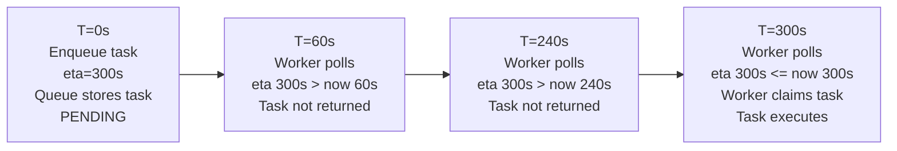
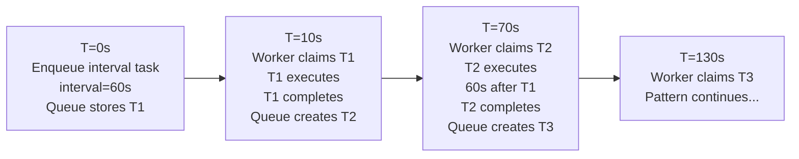
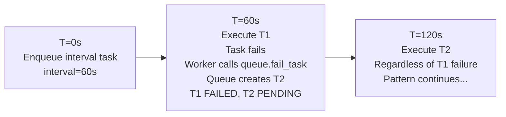
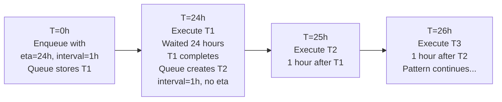
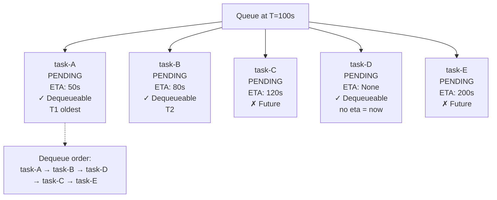

# Scheduling Model

Learn about OmniQ's scheduling semantics for ETA (delayed execution) and interval (repeating) tasks.

## Overview

OmniQ provides two scheduling mechanisms:

1. **ETA (Estimated Time of Arrival)**: Delay task execution to a specific future time
2. **Interval**: Automatically reschedule task after completion for repeating execution

These mechanisms work together with the queue's FIFO ordering and retry policy.

## ETA (Delayed Execution)

ETA allows you to schedule a task to execute at a specific time in the future.

### How ETA Works

When you enqueue a task with `eta`:

1. Task is stored with `status=PENDING` and `eta=<timestamp>`
2. Queue only returns tasks where `eta <= now()`
3. Workers poll and discover tasks when they become due
4. Task executes at or after the specified time

### ETA Semantics

```python
from datetime import datetime, timedelta, timezone

# Schedule for 5 minutes from now
eta_time = datetime.now(timezone.utc) + timedelta(minutes=5)

task_id = await omniq.enqueue(
    my_task,
    data,
    eta=eta_time
)
```

**Key behaviors**:
- Tasks with `eta` are not dequeued until `eta <= current time`
- Multiple tasks can have same `eta` (executed in FIFO order)
- `eta` must be timezone-aware (recommended: UTC)
- Task can be cancelled before execution by marking as FAILED

### Example Timeline



## Interval Tasks

Interval tasks automatically reschedule themselves after completion.

### How Interval Works

When you enqueue a task with `interval`:

1. Initial task created with `status=PENDING` and `interval=<value>`
2. Worker claims and executes task
3. Task completes, worker calls `queue.complete_task()`
4. Queue creates **new task** with same interval
5. Process repeats for each execution

**Important**: Each execution creates a **new task ID**.

### Interval Semantics

```python
from datetime import timedelta

# Repeat every 30 minutes
task_id = await omniq.enqueue(
    heartbeat_task,
    interval=timedelta(minutes=30)
)

# Repeat every 10 seconds (using milliseconds)
task_id = await omniq.enqueue(
    monitor_task,
    interval=10000  # 10000 milliseconds = 10 seconds
)
```

**Key behaviors**:
- New task created after **each** completion (not based on enqueue time)
- Failed executions still reschedule (next execution with same interval)
- Each execution has independent task ID
- Interval tasks run until cancelled (no automatic stop)

### Example Timeline



### Failure Rescheduling

Failed interval tasks **still reschedule**:



**Design implication**: Ensure interval tasks are idempotent or handle partial state.

## Combined ETA and Interval

You can combine ETA with interval for delayed recurring tasks.

### Semantics

```python
# Start tomorrow, repeat every hour
start_time = datetime.now(timezone.utc) + timedelta(days=1)

task_id = await omniq.enqueue(
    daily_report_task,
    interval=timedelta(hours=1),
    eta=start_time
)
```

**Execution timeline**:
1. Wait until `eta` (tomorrow)
2. Execute initial task
3. Create new task with same `interval` (hourly from initial execution, not from enqueue time)

### Example Timeline



**Note**: Interval starts from **initial execution**, not enqueue time.

## Dequeue Ordering

The queue uses FIFO ordering combined with ETA:

### Priority Rules

1. **ETA-sorted**: Tasks sorted by `eta` (earliest first)
2. **Tie-breaking**: FIFO for tasks with same `eta`
3. **No ETA**: Tasks without `eta` treated as `eta=now()`

### Dequeue Algorithm

```python
# Simplified queue dequeue logic
def dequeue(self):
    now = datetime.now(timezone.utc)

    # Get tasks with eta <= now
    eligible_tasks = [
        t for t in self.storage.list_tasks()
        if t.status == "PENDING"
        and t.eta <= now
    ]

    if not eligible_tasks:
        return None  # No tasks due yet

    # Sort by eta (FIFO for ties)
    eligible_tasks.sort(key=lambda t: t.eta)

    # Return earliest task
    return eligible_tasks[0]
```

### Example Queue State



## Worker Polling

Workers poll the queue at regular intervals (`poll_interval`) to discover new tasks.

### Polling Behavior

```python
async def worker_loop():
    while running:
        # Check queue for tasks
        task = await queue.dequeue()

        if task:
            # Execute task
            await execute(task)
        else:
            # No tasks, wait before next poll
            await asyncio.sleep(poll_interval)
```

### Polling and ETA

Workers automatically respect ETA during polling:

1. Worker calls `queue.dequeue()`
2. Queue checks for tasks with `eta <= now()`
3. If tasks found, return earliest
4. If no tasks due yet, return `None`
5. Worker waits `poll_interval` and retries

**Result**: Workers naturally discover tasks when they become due.

### Polling Configuration

```python
# Default: poll every 1 second
workers = omniq.worker(concurrency=2, poll_interval=1.0)

# Faster discovery: poll every 0.5 seconds
workers = omniq.worker(concurrency=2, poll_interval=0.5)

# Less overhead: poll every 5 seconds
workers = omniq.worker(concurrency=2, poll_interval=5.0)
```

**Trade-offs**:
- **Fast polling**: Lower latency, higher CPU usage
- **Slow polling**: Higher latency, lower CPU usage

## Timezone Handling

### Recommended: Use UTC

```python
from datetime import datetime, timezone

# Recommended (timezone-aware, UTC)
eta = datetime.now(timezone.utc) + timedelta(hours=1)

# Not recommended (timezone-naive)
eta = datetime.now() + timedelta(hours=1)  # ❌
```

**Why UTC?**
- Unambiguous across timezones
- Consistent for distributed systems
- Daylight saving time transparent

### Timezone Example

```
Server in UTC (T=12:00 UTC):

User enqueues with eta=13:00 (naive)
├─ System interprets as 13:00 UTC (if server UTC)
├─ Expected: 1 hour from now
└─ Actual: 1 hour from now ✓

User enqueues with eta=13:00 local (EST, UTC-5):
├─ User: 13:00 EST = 18:00 UTC
├─ Server: 18:00 UTC
└─ Delay: 6 hours (unexpected!)
```

## Common Patterns

### 1. Delayed Batch Processing

```python
# Process all items tomorrow at 2 AM
batch_time = datetime.now(timezone.utc).replace(
    hour=2, minute=0, second=0
) + timedelta(days=1)

for item_id in item_ids:
    await omniq.enqueue(process_item, item_id, eta=batch_time)
```

### 2. Regular Health Checks

```python
# Check health every 5 minutes
await omniq.enqueue(
    check_health,
    interval=timedelta(minutes=5)
)
```

### 3. Delayed Recurring Reports

```python
# Start Monday morning, repeat daily
next_monday = datetime.now(timezone.utc) + timedelta(days=1)
next_monday = next_monday.replace(
    hour=9, minute=0, second=0, microsecond=0
)

await omniq.enqueue(
    generate_daily_report,
    interval=timedelta(days=1),
    eta=next_monday
)
```

### 4. Stagger Task Execution

```python
# Stagger 100 tasks over 10 minutes
for i, item_id in enumerate(item_ids):
    delay_seconds = (i / 100) * 600  # 0 to 600 seconds
    eta = datetime.now(timezone.utc) + timedelta(seconds=delay_seconds)

    await omniq.enqueue(process_item, item_id, eta=eta)
```

## Edge Cases

### 1. ETA in Past

```python
# ETA in past
eta = datetime.now(timezone.utc) - timedelta(hours=1)

await omniq.enqueue(task, data, eta=eta)
```

**Result**: Task is immediately eligible for dequeuing (treated as `eta=now()`).

### 2. Very Short Intervals

```python
# Interval = 100ms
await omniq.enqueue(fast_task, interval=0.1)  # seconds
```

**Result**: Tasks execute rapidly. Ensure:
- Tasks are very fast (sub-millisecond)
- Workers have high concurrency
- System can handle high task throughput

### 3. Long-Running Interval Tasks

```python
# Interval = 1 hour, task takes 2 hours
await omniq.enqueue(long_task, interval=3600)  # 1 hour in seconds
```

**Result**: Overlapping executions (next task starts while previous still running).

**Mitigation**: Use mutex or check if previous execution still in progress:

```python
_running_tasks = set()

def interval_task():
    task_id = get_task_id()

    if task_id in _running_tasks:
        print("Previous execution still running, skipping")
        return

    _running_tasks.add(task_id)
    try:
        # Do work...
        pass
    finally:
        _running_tasks.remove(task_id)
```

## Best Practices

### 1. Always Use Timezone-Aware Times

```python
# Bad
eta = datetime(2025, 1, 1, 12, 0)  # Naive

# Good
eta = datetime.now(timezone.utc) + timedelta(hours=1)  # Aware
```

### 2. Choose Appropriate Interval

```python
# Too fast: unnecessary overhead
await omniq.enqueue(task, interval=timedelta(seconds=1))

# Good: realistic frequency
await omniq.enqueue(task, interval=timedelta(minutes=5))
```

### 3. Monitor Interval Task Execution

```python
# Track execution frequency
 executions = {}

def monitor_interval_task(task_id: str):
    executions[task_id] = executions.get(task_id, 0) + 1

    if executions[task_id] > 1000:
        print(f"Warning: Task {task_id} executed {executions[task_id]} times")
```

### 4. Document Expected Behavior

```python
"""
Heartbeat task runs every 30 seconds.
Checks service health and logs metrics.
Expected: ~2,880 executions per day.
"""
def heartbeat_task():
    check_health()
    log_metrics()
```

## Next Steps

- Read [retry mechanism explanation](retry_mechanism.md) for how retries interact with scheduling
- Understand [storage tradeoffs](storage-tradeoffs.md) for backend differences
- See [scheduling tutorial](../tutorials/scheduling.md) for examples

## Summary

- **ETA**: Delayed execution to specific time (timezone-aware recommended)
- **Interval**: Repeating tasks (new task each execution)
- **Combined**: Delayed recurring tasks (start at ETA, repeat by interval)
- **Ordering**: FIFO, ETA-sorted (earliest due first)
- **Polling**: Workers discover due tasks at poll_interval
- **Best practice**: Use UTC times, realistic intervals, monitor execution

OmniQ's scheduling model provides flexible delayed and repeating task execution with clear semantics, FIFO ordering, and automatic worker discovery of due tasks.
