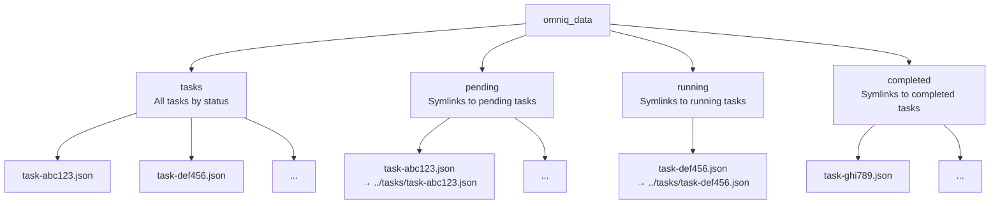

# Storage Backend Tradeoffs

Learn about the tradeoffs between File and SQLite storage backends to choose the right one for your use case.

## Overview

OmniQ supports two storage backends with different characteristics:

| Feature | File Backend | SQLite Backend |
|----------|---------------|-----------------|
| **Format** | JSON files | SQLite database |
| **Dependencies** | Standard library only | `aiosqlite` package |
| **Performance** | Slower with many tasks | Faster with indexing |
| **Concurrency** | Not optimized | ACID transactions |
| **Scalability** | Limited | High |
| **Readability** | Human-readable JSON | Requires SQLite client |
| **Portability** | Copy directory | Copy .db file |
| **Use Case** | Development, simple apps | Production, concurrent access |

## File Backend

### Architecture

The file backend stores each task as a separate JSON file in a directory structure.

### Directory Layout



### Storage Format

Each task is a JSON file:

```json
{
  "id": "task-abc123",
  "func_path": "my_module.my_function",
  "args": [1, 2, 3],
  "kwargs": {"option": true},
  "status": "PENDING",
  "attempts": 0,
  "max_retries": 3,
  "timeout": 60.0,
  "eta": "2025-12-01T10:00:00Z",
  "interval": null,
  "enqueued_at": "2025-12-01T09:59:00Z",
  "started_at": null,
  "completed_at": null,
  "failed_at": null,
  "result": null,
  "error": null
}
```

### File Operations

```python
# Enqueue: write task JSON + create symlink
os.symlink("../tasks/task-abc123.json", "pending/task-abc123")

# Dequeue: read symlink, move to running
os.rename("pending/task-abc123", "running/task-abc123")

# Complete: move symlink, write result to task JSON
os.rename("running/task-abc123", "completed/task-abc123.json")
task_data["result"] = result_value
task_data["completed_at"] = datetime.now().isoformat()
with open("tasks/task-abc123.json", "w") as f:
    json.dump(task_data, f)
```

### Advantages

#### 1. Zero External Dependencies

```python
# Works with standard library only
import json
import os
from pathlib import Path

# No pip install required beyond OmniQ itself
```

#### 2. Human-Readable

```bash
# Inspect tasks manually
cat omniq_data/tasks/task-abc123.json
{
  "id": "task-abc123",
  "status": "PENDING",
  "func_path": "process_data",
  "args": ["item-123"]
}
```

#### 3. Easy Backup and Migration

```bash
# Copy entire directory
cp -r omniq_data omniq_data_backup

# Move to different server
rsync -av omniq_data/ server:/var/lib/omniq/
```

#### 4. Simple Debugging

```bash
# Check task counts
ls omniq_data/pending/ | wc -l
# 42 pending tasks

# Find stuck tasks
ls omniq_data/running/
# task-stuck123.json
```

### Disadvantages

#### 1. Poor Concurrency Support

File operations are not atomic or transactional:

```python
# Race condition example:
# Worker 1: reads pending/ -> finds task-abc123
# Worker 2: reads pending/ -> finds task-abc123
# Both move to running/ -> duplicate claims
```

Mitigation: Use SQLite backend for concurrent workers.

#### 2. Limited Performance

Operations are file I/O bound:

| Operation count | Time (approx) |
|----------------|-----------------|
| 100 tasks | ~200ms |
| 1,000 tasks | ~2s |
| 10,000 tasks | ~20s |
| 100,000 tasks | ~200s |

Mitigation: Use SQLite backend for high task volumes.

#### 3. No Query Optimization

Finding tasks requires scanning files:

```python
# Find pending tasks (must list directory)
pending_files = os.listdir("omniq_data/pending/")
for filename in pending_files:
    task_path = f"omniq_data/pending/{filename}"
    with open(task_path) as f:
        task = json.load(f)
        if task["eta"] <= now():
            return task
```

Mitigation: SQLite uses indexes for O(log n) lookups.

#### 4. No Transaction Safety

Crashes during operations can cause corruption:

```python
# Crash scenario:
os.symlink("../tasks/task-abc123.json", "pending/task-abc123")
# ← CRASH HERE → symlink created but task JSON not updated
```

Result: Stale state, requires manual cleanup.

## SQLite Backend

### Architecture

The SQLite backend uses a SQLite database with normalized tables and indexes.

### Database Schema

```sql
-- Tasks table (core task data)
CREATE TABLE tasks (
    id TEXT PRIMARY KEY,
    func_path TEXT NOT NULL,
    args TEXT,  -- JSON array
    kwargs TEXT,  -- JSON object
    status TEXT NOT NULL,  -- PENDING/RUNNING/COMPLETED/FAILED
    attempts INTEGER DEFAULT 0,
    max_retries INTEGER DEFAULT 3,
    timeout REAL,
    eta TIMESTAMP,
    interval INTEGER,  -- milliseconds
    enqueued_at TIMESTAMP NOT NULL,
    started_at TIMESTAMP,
    completed_at TIMESTAMP,
    failed_at TIMESTAMP,
    result TEXT,  -- JSON
    error TEXT     -- JSON
);

-- Indexes for performance
CREATE INDEX idx_status_eta ON tasks(status, eta);
CREATE INDEX idx_interval ON tasks(interval);
```

### Transaction Examples

```python
# Atomic task claim (BEGIN TRANSACTION)
async def claim_task(self, task_id: str, worker_id: str):
    async with aiosqlite.connect(self.db_path) as db:
        await db.execute("BEGIN TRANSACTION")

        # Check task still pending
        cursor = await db.execute(
            "SELECT status FROM tasks WHERE id=?",
            (task_id,)
        )
        status = cursor.fetchone()

        if status != "PENDING":
            # Race condition, rollback
            await db.execute("ROLLBACK")
            return False

        # Update to RUNNING
        await db.execute(
            "UPDATE tasks SET status=?, started_at=?, worker_id=? WHERE id=?",
            ("RUNNING", datetime.now(), worker_id, task_id)
        )

        await db.execute("COMMIT")
        return True
```

### Advantages

#### 1. High Performance

Indexes optimize queries:

| Operation | File Backend | SQLite Backend |
|-----------|---------------|-----------------|
| Dequeue (1000 tasks) | ~1.5s | ~100ms |
| Claim task | ~5ms | ~5ms |
| Complete task | ~10ms | ~10ms |
| List all tasks | ~500ms | ~50ms |

**Result**: ~10-15x faster for large task volumes.

#### 2. ACID Transactions

Operations are atomic and consistent:

```python
# Either all succeed or all rollback
await db.execute("BEGIN TRANSACTION")

try:
    await db.execute("UPDATE tasks SET status='RUNNING' WHERE id=?", (task_id,))
    await db.execute("INSERT INTO results ...")
    await db.execute("UPDATE tasks SET status='COMPLETED' ...")

    await db.execute("COMMIT")
except Exception:
    await db.execute("ROLLBACK")  # Partial state prevented
```

#### 3. Concurrent Access Safe

Multiple workers can safely claim tasks:

```python
# Worker 1: BEGIN TRANSACTION
# Worker 1: SELECT ... WHERE id='task-abc' AND status='PENDING'
# Worker 1: UPDATE ... SET status='RUNNING'
# Worker 1: COMMIT

# Worker 2: BEGIN TRANSACTION (later)
# Worker 2: SELECT ... WHERE id='task-abc' AND status='PENDING'
# Worker 2: No rows (already RUNNING)
# Worker 2: ROLLBACK (nothing to do)
```

#### 4. Query Optimization

Indexes make lookups efficient:

```sql
-- Fast lookup for dequeue (pending tasks ordered by ETA)
SELECT * FROM tasks
WHERE status='PENDING' AND eta <= datetime('now')
ORDER BY eta ASC
LIMIT 1;

-- Index on (status, eta) makes this O(log n)
```

### Disadvantages

#### 1. External Dependency

```bash
# Must install aiosqlite
pip install omniq  # Installs aiosqlite automatically
```

If `aiosqlite` unavailable, SQLite backend fails to initialize.

#### 2. Less Human-Readable

Need SQLite client to inspect data:

```bash
# Requires sqlite3 command
sqlite3 omniq.db "SELECT * FROM tasks LIMIT 5;"

# JSON format requires query
sqlite3 omniq.db "SELECT json_object('id', id, 'status', status) FROM tasks LIMIT 1;"
```

#### 3. Binary Format

Cannot easily inspect task data with text editors:

```bash
# File backend: human-readable
cat omniq_data/tasks/task-abc123.json  # ✓

# SQLite backend: binary
cat omniq.db  # ✗ Binary data, not readable
```

#### 4. Backup Complexity

Database file requires special handling:

```bash
# Must ensure database not in use
sqlite3 omniq.db ".backup omniq_backup.db"

# Cannot just copy directory
cp omniq.db omniq_backup.db  # ❌ May corrupt
```

## Decision Guide

### Use File Backend If

✅ **Single worker application**
   - No concurrent access to queue
   - Simpler implementation sufficient

✅ **Development environment**
   - Need to inspect tasks manually for debugging
   - Task volume low (<1000)

✅ **Portability priority**
   - Easy to move between systems
   - Copy directory, no database tools needed

✅ **Minimal dependencies**
   - Want zero external dependencies beyond Python stdlib
   - Cannot install `aiosqlite` (constrained environments)

❌ **Avoid If**
   - Multiple workers (concurrency > 1)
   - High task volume (>1000 tasks)
   - Need transactional integrity
   - Performance-critical application

### Use SQLite Backend If

✅ **Multiple workers**
   - Need concurrent access to queue
   - Require atomic task claims

✅ **Production environment**
   - High task volume (>1000 tasks)
   - Need ACID guarantees for reliability

✅ **Performance critical**
   - Fast dequeue and lookup important
   - Many tasks in queue

✅ **Database operations**
   - Familiar with SQL and database tools
   - Can use standard SQLite tooling

❌ **Avoid If**
   - Development with manual inspection needed
   - Cannot install `aiosqlite` (should be rare)
   - Need simple file portability

## Performance Benchmarks

### Throughput Comparison

Test: Enqueue and complete 1000 sequential tasks

| Backend | Enqueue Time | Dequeue Time | Total |
|---------|---------------|----------------|--------|
| File | ~500ms | ~1500ms | ~2s |
| SQLite | ~300ms | ~100ms | ~400ms |

### Concurrent Worker Test

Test: 4 workers processing 1000 tasks (concurrency=4)

| Backend | Total Time | Throughput |
|---------|------------|-------------|
| File | ~25s | 40 tasks/sec |
| SQLite | ~5s | 200 tasks/sec |

**Result**: SQLite ~5x faster with concurrent workers.

### Large Scale Test

Test: 10,000 tasks in queue, dequeue all

| Backend | List Time | Dequeue All Time | Memory Usage |
|---------|-----------|-------------------|--------------|
| File | ~5s | ~30s | 150MB (10k JSON files) |
| SQLite | ~0.5s | ~3s | 30MB (single .db file) |

**Result**: SQLite ~10x faster, ~5x less memory.

## Migration Guide

### File to SQLite

```python
import asyncio
from pathlib import Path
from omniq import AsyncOmniQ
from omniq.config import Settings

async def migrate_file_to_sqlite():
    # Source: File backend
    file_omniq = AsyncOmniQ(Settings(
        backend="file",
        base_dir=Path("./file_data")
    ))

    # Destination: SQLite backend
    sqlite_omniq = AsyncOmniQ(Settings(
        backend="sqlite",
        base_dir=Path("./sqlite_data")
    ))

    # Migrate all tasks
    tasks = await file_omniq.list_tasks()
    print(f"Migrating {len(tasks)} tasks...")

    for task in tasks:
        # Re-enqueue to SQLite backend
        task_id = await sqlite_omniq.enqueue(
            task["func_path"],
            task["args"],
            task["kwargs"],
            eta=task.get("eta"),
            interval=task.get("interval"),
            max_retries=task.get("max_retries", 3),
            timeout=task.get("timeout")
        )

        print(f"Migrated: {task['id']} -> {task_id}")

    print("Migration complete!")
    print(f"Source: ./file_data/")
    print(f"Destination: ./sqlite_data/")

if __name__ == "__main__":
    asyncio.run(migrate_file_to_sqlite())
```

### SQLite to File

Reverse the above process: list tasks from SQLite, re-enqueue to File backend.

## Best Practices

### 1. Start with File Backend

```python
# Development: easy debugging
settings = Settings(backend="file", base_dir="./dev_data")
```

### 2. Switch to SQLite for Production

```python
# Production: performance and concurrency
settings = Settings(backend="sqlite", base_dir="/var/lib/omniq")
```

### 3. Use Environment for Backend Selection

```python
import os

# Allow flexible backend switching
os.environ["OMNIQ_BACKEND"] = "sqlite"  # or "file"
omniq = AsyncOmniQ.from_env()
```

### 4. Monitor Performance

```python
import time

# Check operation performance
start = time.time()
tasks = await omniq.list_tasks()
elapsed = time.time() - start

print(f"Listed {len(tasks)} tasks in {elapsed:.3f}s")

if elapsed > 1.0:
    print("Warning: slow storage operations")
    print("Consider migrating to SQLite backend for better performance")
```

## Next Steps

- See [how-to choose backend](../how-to/choose-backend.md) for configuration
- Read [storage API reference](../reference/api/storage.md) for backend details
- Understand [retry mechanism](retry_mechanism.md) for interaction with storage

## Summary

- **File backend**: Simple, zero-dependencies, human-readable, good for development
- **SQLite backend**: Performant, concurrent-safe, ACID transactions, good for production
- **Decision factors**: Worker count, task volume, performance needs, dependency constraints
- **Recommendation**: File for dev/simple apps, SQLite for production/concurrent/high-volume

Choose File backend for development, single-worker applications, and when you need manual inspection. Choose SQLite backend for production, multiple workers, high task volumes, and when performance and reliability are critical.
