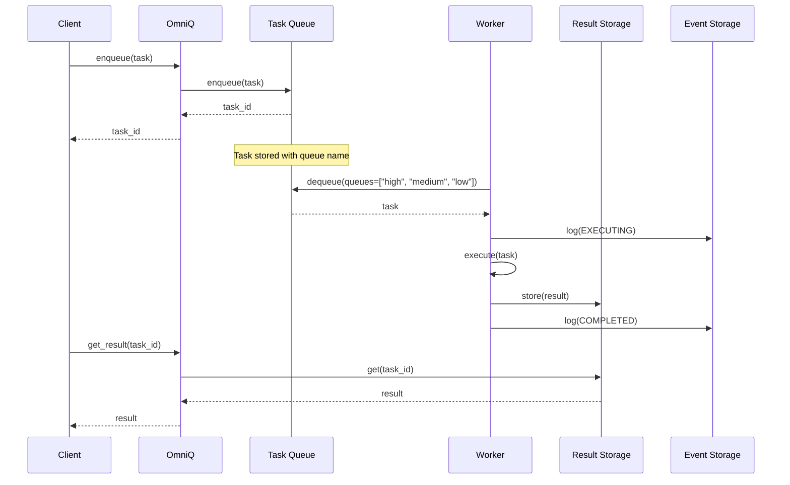

# OmniQ: A Flexible Task Queue Library for Python

## Project Description

OmniQ is a modular Python task queue library designed for both local and distributed task processing. It provides a flexible architecture that supports multiple storage backends, worker types, and configuration methods. OmniQ enables developers to easily implement task queuing, scheduling, and distributed processing in their applications with both synchronous and asynchronous interfaces.

**Key Features:**

- Multiple storage backends (File, Memory, SQLite, PostgreSQL, Redis, NATS)
- Multiple worker types (Async, Thread Pool, Process Pool, Gevent)
- Support for both synchronous and asynchronous tasks and interfaces
- Task scheduling with cron and interval patterns (including pause/resume capability)
- Task dependencies and workflow management
- Task lifecycle event logging
- Result storage and retrieval
- Flexible configuration via code, objects, dictionaries, YAML files, or environment variables
- Multiple named queues with priority ordering
- Cloud storage support through fsspec (S3, Azure, GCP)
- TTL for tasks and results with automatic cleanup

## Python Libraries Overview

### Core Dependencies

- **msgspec**: High-performance serialization and validation
- **dill**: Advanced object serialization beyond pickle
- **fsspec**: Filesystem abstraction for local and cloud storage
- **pyyaml**: YAML file parsing for configuration
- **python-dateutil**: Date and time utilities for scheduling
- **croniter**: Cron-style scheduling implementation

### Storage Backends

- **aiosqlite**: Async SQLite database interface
- **asyncpg**: Async PostgreSQL database interface
- **redis**: Redis client (includes redis.asyncio)
- **nats-py**: NATS messaging system client

### Cloud Storage (Optional)

- **s3fs**: S3 filesystem implementation for fsspec
- **adlfs**: Azure Data Lake filesystem implementation for fsspec
- **gcsfs**: Google Cloud Storage filesystem implementation for fsspec

### Worker Implementations

- **gevent**: Coroutine-based concurrency library for Gevent worker

### Development Dependencies

- **pytest**: Testing framework
- **pytest-asyncio**: Async testing support for pytest
- **pytest-cov**: Test coverage reporting
- **black**: Code formatting
- **isort**: Import sorting
- **mypy**: Static type checking
- **ruff**: Fast Python linter

## Core Design Principles

- **Async First, Sync Wrapped:** The core library is implemented asynchronously for maximum performance, with synchronous wrappers providing a convenient blocking API
- **Separation of Concerns:** Task queue, result storage, and event logging are decoupled and independent
- **Interface-Driven:** All components implement common interfaces
- **Storage Abstraction:** Use `fsspec` for file and memory storage with extended capabilities
- **Worker Flexibility:** Support multiple worker types (async, thread, process, gevent)
- **Serialization Strategy:** Intelligent serialization with `msgspec` and `dill` for task enqueuing/dequeuing
- **Configuration Flexibility:** Support multiple configuration methods (code, objects, dictionaries, YAML, environment variables)
- **Storage Independence:** Allow independent selection of storage backends for tasks, results, and events
- **SQL-Based Event Logging:** Use SQL or structured storage for efficient event querying and analysis
- **Task Lifecycle Management:** Support task TTL and automatic cleanup of expired tasks
- **Flexible Scheduling:** Enable pausing and resuming of scheduled tasks

## Architecture Overview

```mermaid
flowchart TD
    A[OmniQ] --> B[Task Queue]
    A --> C[Result Storage]
    A --> D[Event Storage]
    A --> E[Worker]
    A --> F[Backend]
    
    B --> B1[File Queue]
    B --> B2[Memory Queue]
    B --> B3[SQLite Queue]
    B --> B4[PostgreSQL Queue]
    B --> B5[Redis Queue]
    B --> B6[NATS Queue]
    
    C --> C1[File Storage]
    C --> C2[Memory Storage]
    C --> C3[SQLite Storage]
    C --> C4[PostgreSQL Storage]
    C --> C5[Redis Storage]
    C --> C6[NATS Storage]
    
    D --> D1[SQLite Storage]
    D --> D2[PostgreSQL Storage]
    D --> D3[File Storage]
    
    E --> E1[Async Worker]
    E --> E2[Thread Pool Worker]
    E --> E3[Process Pool Worker]
    E --> E4[Gevent Pool Worker]
    
    F[Backend] --> F1[File Backend]
    F --> F2[SQLite Backend]
    F --> F3[PostgreSQL Backend]
    F --> F4[Redis Backend]
    F --> F5[NATS Backend]
    
    F1 --> B1
    F1 --> C1
    F1 --> D3
    
    F2 --> B3
    F2 --> C3
    F2 --> D1
    
    F3 --> B4
    F3 --> C4
    F3 --> D2
    
    F4 --> B5
    F4 --> C5
    
    F5 --> B6
    F5 --> C6
```



### Enhanced System Architecture

```
TaskQueue (Orchestrator)
├── Interface Layer
│   ├── Async API (Core Implementation)
│   └── Sync API (Wrappers around async)
├── Task Management Layer
│   ├── Task (data model with TTL)
│   ├── Schedule (timing logic with pause/resume)
│   └── TaskDependencyGraph (dependency resolution)
├── Storage Layer
│   ├── Task Queue Interface
│   │   ├── File Queue (using fsspec with DirFileSystem for memory, local, S3, Azure, GCP)
│   │   ├── Memory Queue (using fsspec MemoryFileSystem)
│   │   ├── SQLite Queue
│   │   ├── PostgreSQL Queue
│   │   ├── Redis Queue
│   │   └── NATS Queue
│   ├── Result Storage Interface (independent from task queue)
│   │   ├── File Storage (using fsspec for memory, local, S3, Azure, GCP)
│   │   ├── Memory Storage (using fsspec MemoryFileSystem)
│   │   ├── SQLite Storage
│   │   ├── PostgreSQL Storage
│   │   ├── Redis Storage
│   │   └── NATS Storage
│   └── Event Storage Interface (SQL-based or JSON files)
│       ├── SQLite Storage
│       ├── PostgreSQL Storage
│       └── File Storage (JSON files)
├── Execution Layer
│   ├── Worker Types
│   │   ├── Async Workers
│   │   ├── Thread Pool Workers
│   │   ├── Process Pool Workers
│   │   └── Gevent Pool Workers
│   ├── Task Execution
│   └── CallbackManager (lifecycle hooks)
```

### Component Architecture

```mermaid
flowchart TD
    subgraph "OmniQ Interface"
        OmniQ[OmniQ Class]
    end
    
    subgraph "Task Queue Layer"
        TQ[Task Queue Interface]
        TQ --> FQ[File Queue]
        TQ --> MQ[Memory Queue]
        TQ --> SQ[SQLite Queue]
        TQ --> PQ[PostgreSQL Queue]
        TQ --> RQ[Redis Queue]
        TQ --> NQ[NATS Queue]
    end
    
    subgraph "Worker Layer"
        W[Worker Interface]
        W --> AW[Async Worker]
        W --> TW[Thread Pool Worker]
        W --> PW[Process Pool Worker]
        W --> GW[Gevent Pool Worker]
    end
    
    subgraph "Storage Layer"
        RS[Result Storage Interface]
        RS --> FRS[File Result Storage]
        RS --> MRS[Memory Result Storage]
        RS --> SRS[SQLite Result Storage]
        RS --> PRS[PostgreSQL Result Storage]
        RS --> RRS[Redis Result Storage]
        RS --> NRS[NATS Result Storage]
        
        ES[Event Storage Interface]
        ES --> SES[SQLite Event Storage]
        ES --> PES[PostgreSQL Event Storage]
        ES --> FES[File Event Storage]
    end
    
    subgraph "Configuration Layer"
        Config[Configuration System]
        Config --> YamlConfig[YAML Config]
        Config --> EnvConfig[Environment Variables]
        Config --> DictConfig[Dictionary Config]
        Config --> ObjectConfig[Object Config]
    end
    
    subgraph "Backend Layer"
        Backend[Backend Interface]
        Backend --> FB[File Backend]
        Backend --> SB[SQLite Backend]
        Backend --> PB[PostgreSQL Backend]
        Backend --> RB[Redis Backend]
        Backend --> NB[NATS Backend]
    end
    
    OmniQ --> TQ
    OmniQ --> W
    OmniQ --> RS
    OmniQ --> ES
    OmniQ --> Config
    
    Backend --> TQ
    Backend --> RS
    Backend --> ES
    
    TQ <--> W
    W --> RS
    W --> ES
```



### Data Flow

